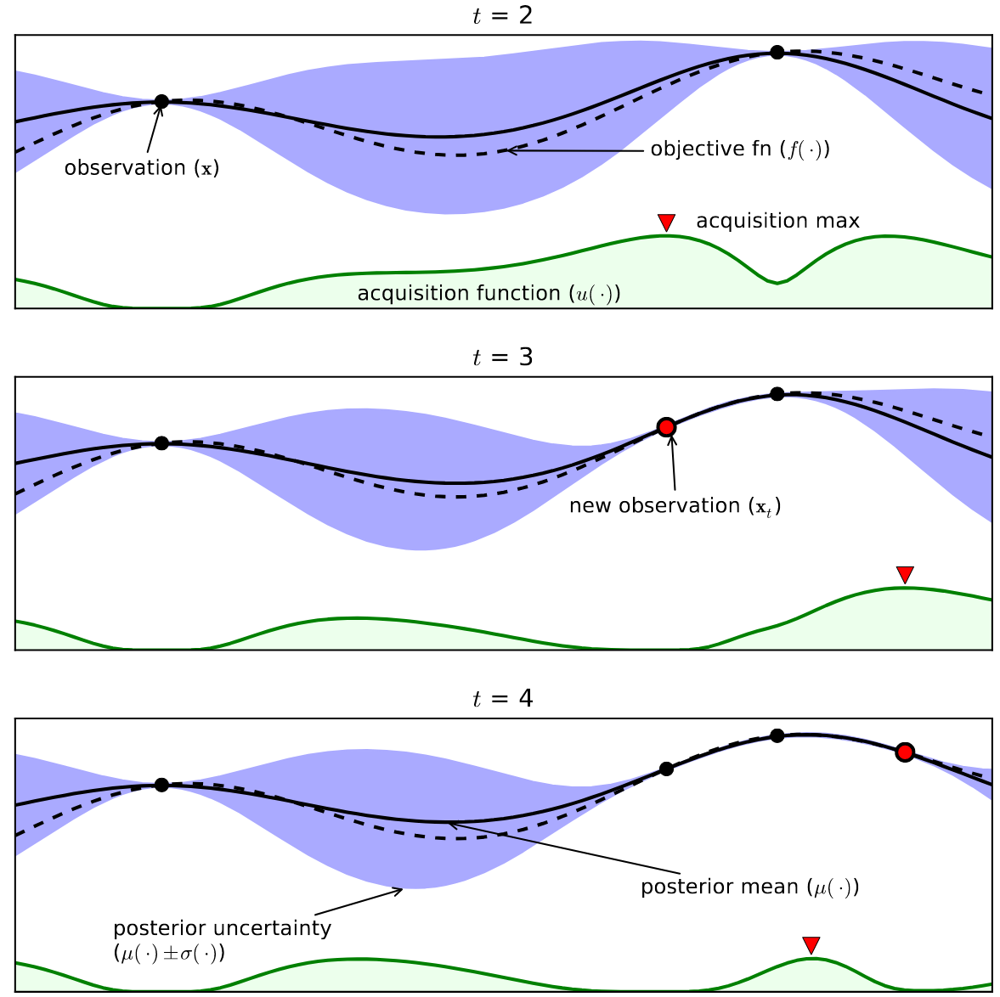

# Influence of Acquisition Functions on Bayesian Optimization of Neural Network Hyperparameters

This project uses [PyTorch Lightning](https://pytorch.org/), [Ax](https://ax.dev/) and [BoTorch](https://botorch.org/) to evaluate Bayesian optimization of feedforward neural network hyperparameters for digit classification and superconductor critical temperature prediction using two separate acquisition functions and comparing them to random search and manually chosen neural network hyperparameters. 

## General Overview of Bayesian Optimization

The general workflow for Bayesian optimization in the context of neural network hyperparameter optimization and architecture search is as follows

1. Define the hyparparameter space $\mathcal{S}$ and any initial hyper-hyperparameters
2. Sample the space randomly to generate an initial set of hyperparameter combinations
    - Generate these combinations in a space-filling manner if possible
3. Evaluate the objective function(s) for each generated and trained neural network
4. Use these initial data to generate estimates for the posterior probability distribution(s) of how the objective function(s) vary with respect to neural network hyperparameters of interest
5. Generate a next set of hyperparameters to test by maximizing an acquisition function using the posterior(s)
6. Evaluate the generated set of hyperparameters
7. Update posterior probability distribution(s)
8. Repeat steps 5 to 7

### A visual example of steps 5 to 7 (from *A Tutorial on Bayesian Optimization of Expensive Cost Functions, with Application to Active User Modeling and Hierarchical Reinforcement Learning*)

    

## Components

- Loading the data for both the digit classification and critical temperature prediction tasks is carried out by the `get_MNIST_data` and `get_Superconductivity_data` functions from `src\network\load_data.py`.

- A set of hyperparameters is evaluated by calling the `evaluate_hyperparameters` function from `src\network\evaluate_network.py`, though this is not typically done directly. The `evaluate_hyperparameters` is a wrapper around the `create_ff_model` function from `src\network\create_network_lightning.py` that takes a set of hyperparameters, generates a PyTorch Lightning neural network module, and extracts performance metrics for the hyperparameters through training the neural network.

- Environmental variables defining the search space and hand-tuned networks for both the digit classification and critical temperature prediction tasks are kept in `src\Ax_BO\experiment_definition.py` for reference by other parts of the repository.

- The actual machinery to conduct a replicate of either Bayesian optimization or random search is kept in the `conduct_experiment` function found in `src\Ax_BO\conduct_experiment.py`. This function is a wrapper to the Ax Service API for adaptive experimentation that is compatible with manual specification of an acquisition function using BoTorch. It initializes an experiment, logs snapshots of the experiment after each hyperparameter evaluation in both CSV and JSON formats, and returns a DataFrame of experimental hyperparameter evaluations along with AxClient and Ax Experiment objects once completed. It also generates interactive plots for the experiment if requested.

- The code in `study_1\study_execution.py` was not directly used for the generation of the data for the study (the experiments were conducted in stages), but the code there should conduct a similar study with the same settings as were used for the experiments described in the project report (minus the random seed)

- The generated experimental data in CSV format used for the report are all in `logs\csv_logs\experiment_logs`, and the experimental JSON files are in `logs\JSON_logs\experiments`

- All the data analysis and plotting for the report is done in `study_1\analysis_and_plotting.py`, and all the plots are saved in `plots`. PDF plots are in `plots\static_plots` and interactive HTML plots are in `plots\html_plots`. The HTML plots do not render in GitHub, but if downloaded can be interacted with.